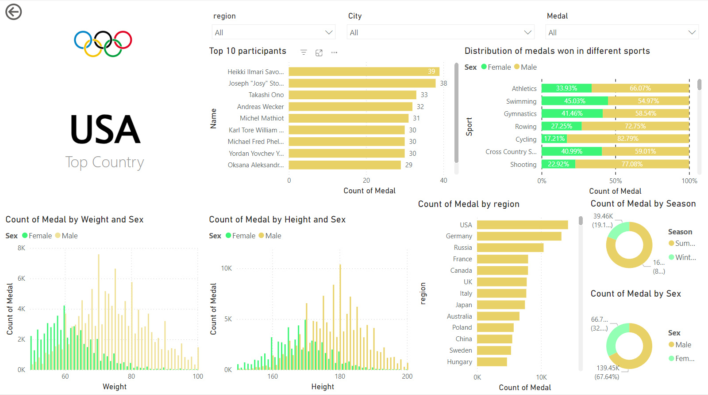

<h1 style="color:yellow">OLYMPICS DATASET DASHBOARD USING POWER BI</h1>

#### Here is a simple interactive DashBoard in Power Bi using the 120 years Olympic dataset from kaggle . The Report aims at providing us insights about the distribution of medals in the olympics data on the basis of factors like gender orientation, activites,height and weight,regions etc.
[Dashboard Link](https://app.powerbi.com/view?r=eyJrIjoiNGQyNjcyMzctNmRhMy00MWM5LTkyOTAtNmFlNTViNGU3MWZkIiwidCI6ImFiZDI2NjRmLTE5NDktNGM0Ny1iMDYyLTdjYjFlNTM4ZTkyMSJ9)

  
## Dashboard Overview

